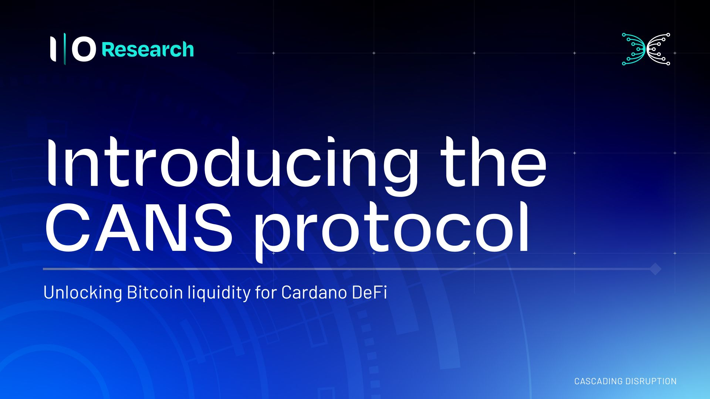

Input Output's Cyclic Atomic N-party Swap (CANS) protocol arranges participants in a ring where each sends assets once and receives once, with the entire swap enforced as atomic: either everyone gets what they agreed to, or nobody loses anything. The design removes the need for bridges, wrapped tokens, or trusted intermediaries by making signatures conditionally valid behind a shared secret revealed only once every party has locked funds. A reference implementation in Rust, formally verified with up to 20 concurrent parties, shows the approach works in practice today, and any chain with native or verifiable Schnorr signatures can join a swap session.

 [**Read more**](https://www.iog.io/news/introducing-the-cans-protocol)

