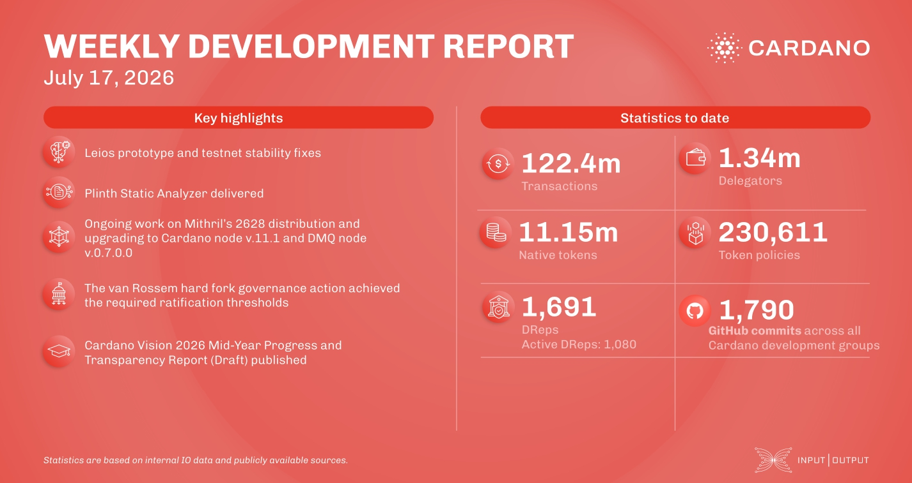

The consensus team stabilized the Leios testnet with two prototype builds and a voting dashboard for endorser block observability. The High Assurance team shipped the Plinth Static Analyzer on the Visual Studio Marketplace and a JSON-RPC backend for property-based testing. Mithril completed the SNARK recursive circuit modularity work and upgraded the midnight-zk library. Under Voltaire, the van Rossem hard fork passed ratification and will enact at the next epoch boundary, advancing Plutus ahead of the Dijkstra era that introduces Ouroboros Leios. The research team published the Cardano Vision 2026 Mid-Year Progress and Transparency Report draft for community feedback.

 [**Read more**](https://www.essentialcardano.io/development-update/weekly-development-report-as-of-2026-07-17)

