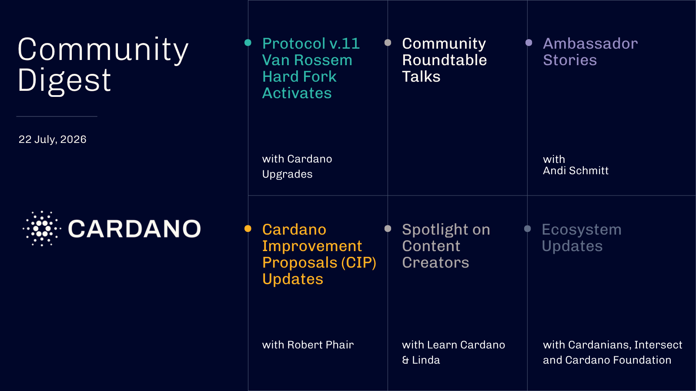

The Van Rossem hard fork activated at Protocol Version 11, marking Cardano's first hard fork proposed, debated, and ratified entirely through on-chain governance. The 2026 Constitutional Committee election entered its final voting days, with candidates discussing the role's realities in the latest Roundtable Talk. New CIPs, including stake pool pruning and handle provider registry updates, entered the review cycle. The Cardano Foundation joined the x402 Foundation and released new Aiken cryptography developer guides, while community spotlights covered Learn Cardano's AI-agent payments update and Linda's ecosystem analysis.

[**Read more**](https://forum.cardano.org/t/digest-july-22-2026-van-rossem-hard-fork-activates-constitutional-committee-election-cardano-foundation-updates-cardano-improvement-proposals-cip-updates-spotlight-on-learn-cardano-linda/155842)

