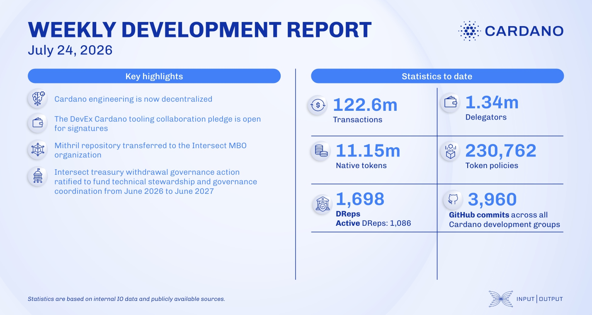

The ledger team continued Leios integration and implemented CIP-181, removing the DRep-delegation requirement for reward withdrawals. The Lace wallet update introduced in-app swaps, CardanoCube integration, and Ledger and Trezor hardware wallet support. The Mithril team completed its non-recursive SNARK proof refactoring and upgraded the midnight-zk library. An Intersect treasury withdrawal of ₳25.4M was ratified to fund technical stewardship and governance coordination.

[**Read more**](https://www.essentialcardano.io/development-update/weekly-development-report-as-of-2026-07-24)

