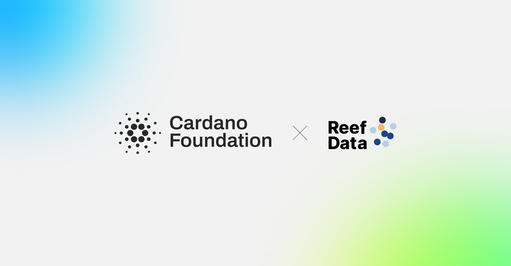

The Cardano Foundation partnered with Reef Data eG, a Hamburg-based data cooperative, to record payment flows transparently and auditably on the Cardano blockchain using Reeve, the Foundation's open-source reporting transparency platform. Reef Data developed the application layer, including a user wallet extension and public and auditor dashboards, while the Foundation provided and extended the Reeve Publisher and Data Reader services. The pilot demonstrates how sales, reward distributions, and member payouts can be verified on-chain by cooperative members and independent auditors.

[**Read more**](https://cardanofoundation.org/blog/reef-data-partnership)

