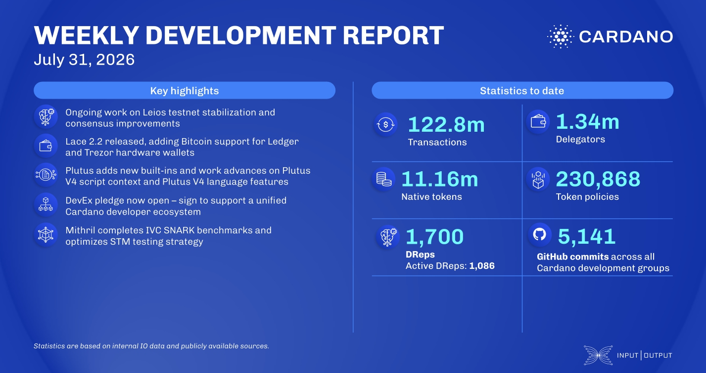

The consensus team released prototype-2026w29, enabling endorser block certification inside the forging loop to raise throughput, and extended the LeiosNotify mini-protocol toward the full block-announcement flow. Lace 2.2 introduced Bitcoin support for Ledger and Trezor hardware wallets, added SeedSigner air-gapped signing, and published the results of an independent security audit. Plutus implemented the multiIndexArray and policies built-ins from CIP-0156 and CIP-0168, gated behind the Dijkstra era, while Mithril completed IVC SNARK benchmarks and prepared the 2630 distribution.

[**Read more**](https://www.essentialcardano.io/development-update/weekly-development-update-as-of-2026-07-31)

