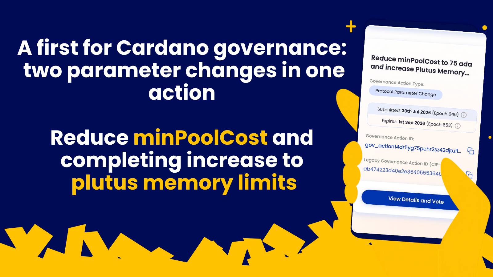

The Intersect Parameter Committee submitted a parameter update governance action combining a minPoolCost reduction from 170 to 75 ada with the second part of a 25% increase to Plutus memory limits. Ratification requires support from both DReps and stake pool operators. The lower fixed fee gives small pools breathing room as block rewards decline, while the completed memory increase eases contract deployment for developers.

[**Read more**](https://www.intersectmbo.org/news/lowering-minpoolcost-and-completing-smart-contract-capacity-increases)

