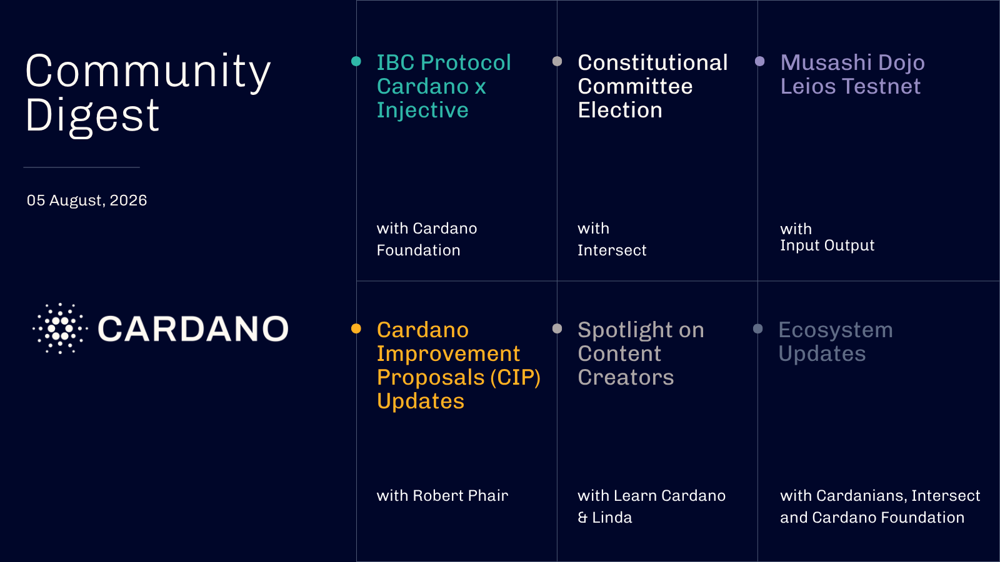

Cardano and Injective are connected via the IBC protocol on testnet, Cardano's first live on-chain IBC rail, enabling native transfers without centralized bridges. The Constitutional Committee election concluded with audited results, confirming Philip DiSarro, Leandros BSP, Marek Mahut, and Cardano Curia as elected candidates. The Musashi Dojo public Leios testnet moved to parameter and load testing ahead of its water phase. The Cardano Foundation announced its Reef Data eG partnership, joined the Energy Tokenization Sandbox, and launched a Governance Applied Academy course, while CIP-0186 on mobile wallet UX completed.

[**Read more**](https://forum.cardano.org/t/digest-august-5-2026-cardano-and-injective-connected-via-ibc-on-testnet-constitutional-committee-election-concludes-musashi-dojo-prepares-for-water-phase-cardano-foundation-updates-cardano-improvement-proposals-cip-updates/156123)

