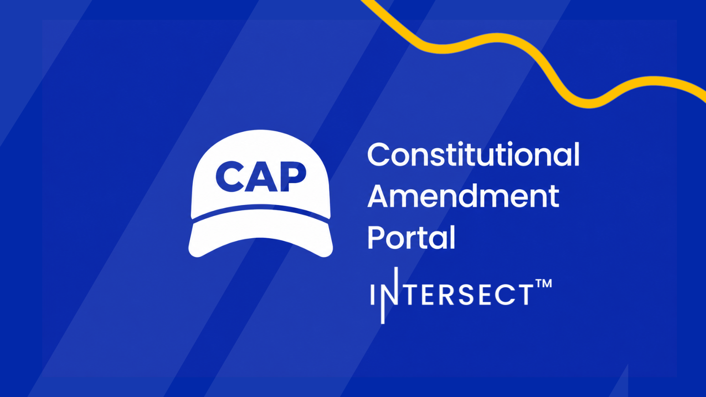

The Constitutional Amendment Portal is live for alpha testing at cap.intersectmbo.org, giving the community a structured home for proposing and refining changes to the Cardano Constitution. Users can highlight a precise passage of the Constitution, submit a Constitutional Amendment Proposal or raise an issue, and follow each proposal through its lifecycle. Wallet connection uses a stake address as identity, with no account, email, or password required.

[**Read more**](https://www.intersectmbo.org/news/the-constitutional-amendment-portal-giving-cardanos-constitution-a-way-to-grow)

