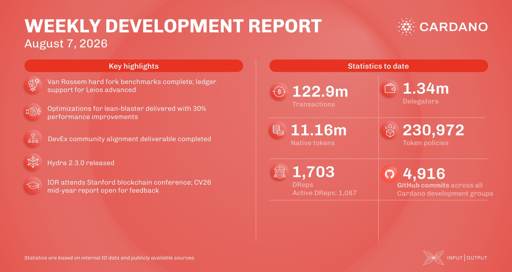

The performance and tracing team completed Van Rossem hard fork benchmarks, while the ledger team advanced Dijkstra nested transactions and implemented CIP-50 pledge-leverage-based staking rewards. Hydra released 2.3.0 with a significant snapshot-processing speedup, YAML node configuration, and native HD wallet key support. The developer experience team completed its Community Alignment deliverable with a live ecosystem map, and IO research opened the Cardano Vision '26 Mid-Year report for community feedback.

[**Read more**](https://www.essentialcardano.io/development-update/weekly-development-report-as-of-2026-08-07)

