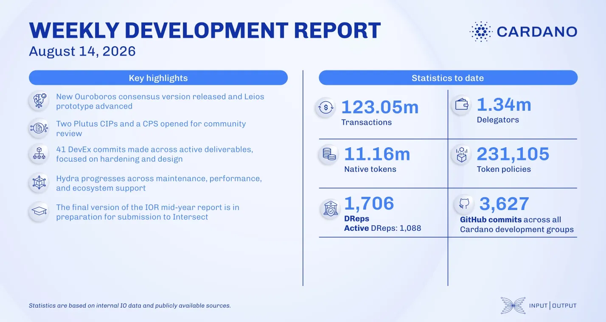

The consensus team released prototype-2026w32, with the node now announcing endorser blocks to peers as a first step toward announcement-based diffusion. Ouroboros-consensus 4.0.0.0 and 4.1 enabled the node to hard fork into the Dijkstra era. The Plutus team opened CIP-0194, CIP-0195 and a new problem statement for community review, and Hydra began rejecting deposits too large to ever be claimed.

[**Read more**](https://www.essentialcardano.io/development-update/weekly-development-report-as-of-2026-08-14)

