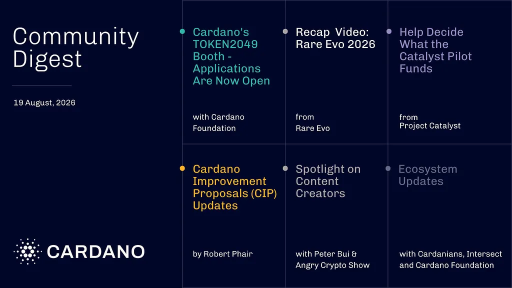

The Cardano Foundation is bringing its largest presence yet to TOKEN2049 in Singapore, with applications open for 20 ecosystem projects to join its booth. Two on-chain votes needed action from DReps and stake pool operators before September 1, among them the 2026 Constitutional Committee update. A new Project Catalyst pilot awards grants of up to 200,000 ada based on real-world usage.

[**Read more**](https://forum.cardano.org/t/digest-august-19-2026-cardano-at-token2049-rare-evo-2026-recap-urgent-governance-call-to-action-rethinking-catalyst-funding-real-world-impact-tech-wins-cip-updates-and-more/156342)

