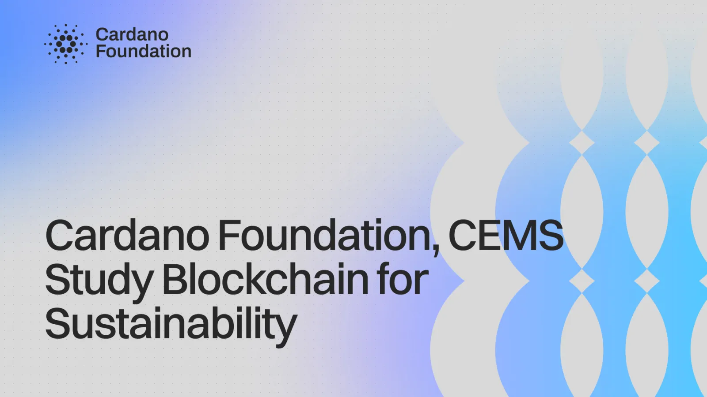

The Cardano Foundation, CEMS and SGH Warsaw School of Economics studied how well public blockchains fit sustainability compliance reporting. The three-month student project produced an analysis of global sustainability regulation, a scorecard for assessing networks against reporting requirements, and a scoped pilot business case showing measurable return on investment. The team also mapped how much regulatory pressure companies face in each region.

[**Read more**](https://cardanofoundation.org/blog/cems-blockchain-sustainability)

