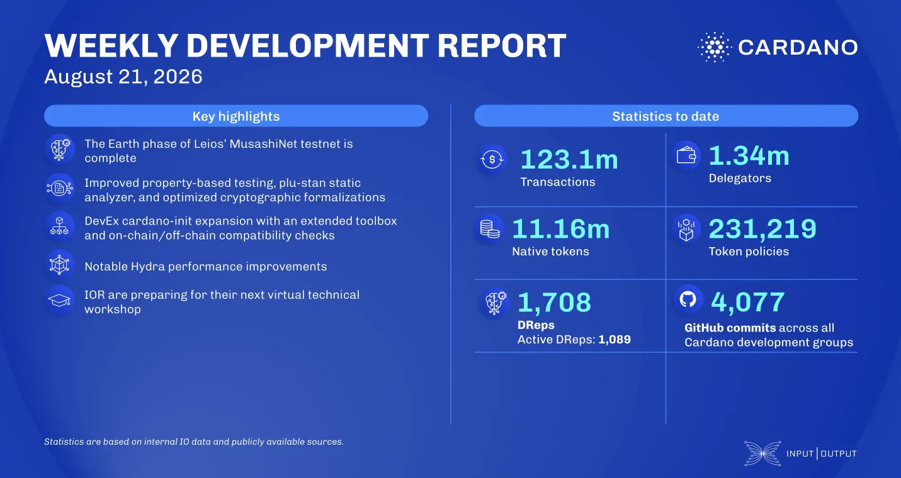

The Leios team completed the Earth phase of MusashiNet, the public testnet, after 41 days that produced over 127,000 blocks and grew participation from three pools to 63. Under synthetic load the network peaked at roughly six times the throughput Praos reaches on mainnet today. The ledger team extended pool distribution with BLS keys, and the Water phase is now open on a fresh chain.

[**Read more**](https://www.essentialcardano.io/development-update/weekly-development-report-as-of-2026-08-21)

