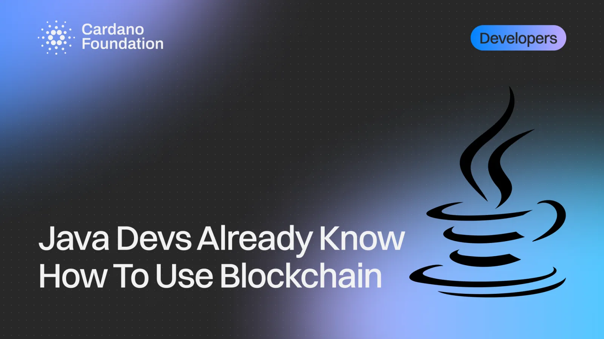

Java developers can build on Cardano with the tools they already use, according to a Cardano Foundation walkthrough of the open-source BloxBean stack. Adding a dependency, writing a test and calling a REST endpoint cover most of what is needed, while the extended UTXO model and validator scripts can be learned gradually alongside. The post also previews three experimental Java projects now in development.

[**Read more**](https://cardanofoundation.org/blog/java-developers-already-know-cardano)

