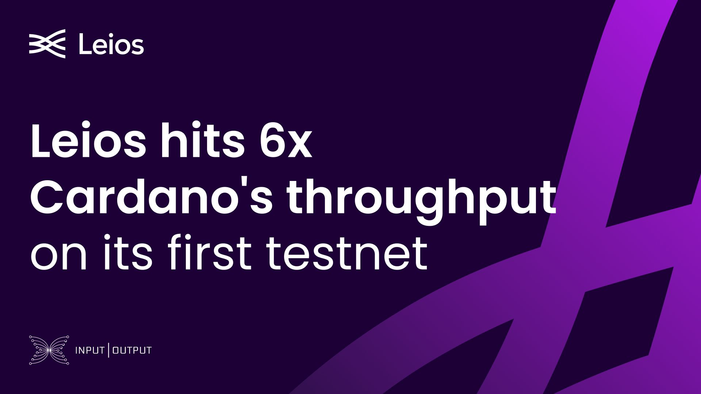

MusashiNet ran for 41 days with 63 pools producing over 127,000 blocks and 30,000 endorser blocks. Leios peaked at 26.8 TxkB/s, six times Cardano's current mainnet ceiling, and carried 54% of chain traffic in stable operation, moving 18x the transaction count of real mainnet traffic. A red team attacked the network without threatening the Praos layer, and the Water phase with a rewards program is live now.

[**Read more**](https://www.iog.io/news/leios-hit-6x-cardano-s-throughput-on-its-first-testnet)

