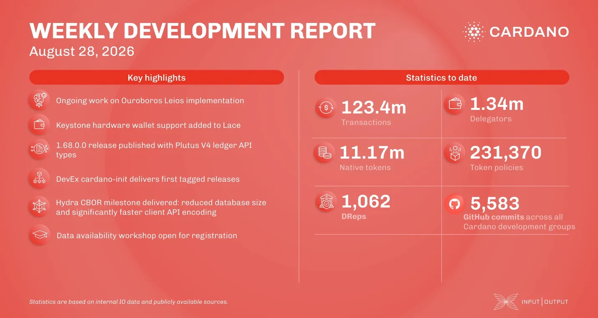

Lace added support for the Keystone hardware wallet in both the browser extension and the mobile app, bringing the wallet to four supported devices. The Plutus team published release 1.68.0.0 with Plutus V4 ledger API types, cardano-init reached its first tagged releases, and Hydra moved persisted event payloads to CBOR, shrinking a three-node benchmark database by more than half. Plinth also gained a one-command install script.

[**Read more**](https://www.essentialcardano.io/development-update/weekly-development-report-as-of-2026-08-28)

