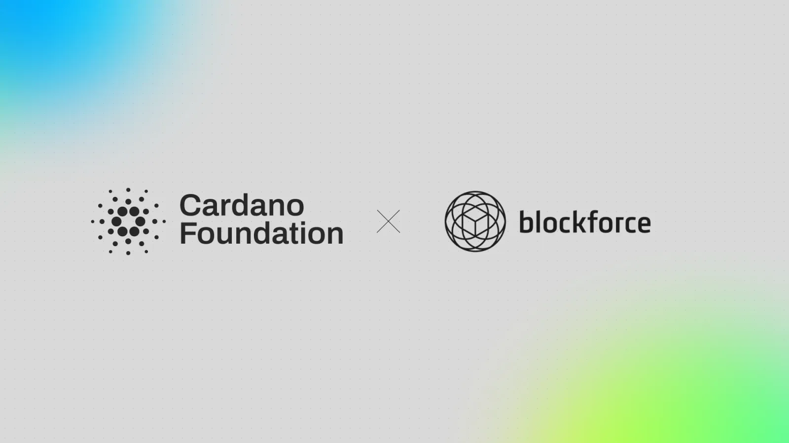

Cardano is now the public proof layer in Blockforce's traceability platform, which has anchored more than 500,000 supply chain records for Brazil's largest fashion groups. Records stay on a permissioned network and only their cryptographic proof reaches Cardano, so auditors can confirm a record is genuine without seeing the underlying data. Engineering work cut the cost per record by 92 percent, and contracts cover 6.5 million records through 2030.

[**Read more**](https://cardanofoundation.org/blog/blockforce-partnership)

