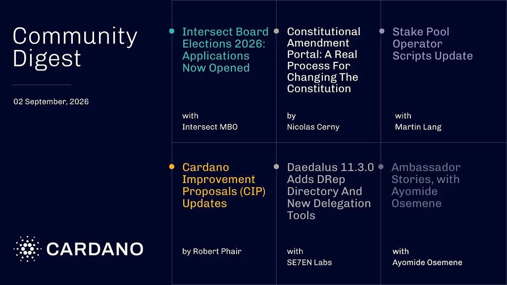

Intersect opened applications for two elected Board seats, with voting from September 14 to 25 and results expected on September 28. The alpha Constitutional Amendment Portal gives ada holders a more accessible way to propose and discuss amendments to the Constitution. Daedalus 11.3.0 adds a DRep directory, and updated stake pool operator scripts support the upcoming LedgerApp v8 and Cardano-Signer v1.35.

[**Read more**](https://forum.cardano.org/t/digest-september-02-2026-intersect-board-elections-2026-constitutional-amendment-portal-stake-pool-operator-scripts-update-daedalus-11-3-0-ambassador-stories-ayomide-osemene/156599)

