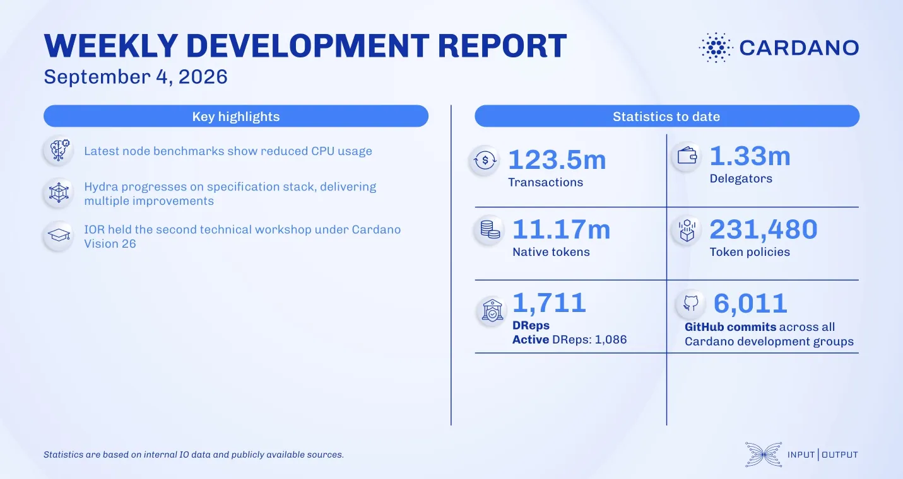

Benchmarks of Cardano node v.11.1.0 showed reduced CPU usage alongside a memory increase that is being addressed in the v.11.1.1 patch release. The Hydra team moved its specification to Typst, formalized it in Agda, and published native Linux ARM64 node images alongside AMD64, with faster Blockfrost query caching. The research team held its second Cardano Vision 26 workshop, covering data availability requirements and specifications.

[**Read more**](https://www.essentialcardano.io/development-update/weekly-development-report-as-of-2026-09-04)

