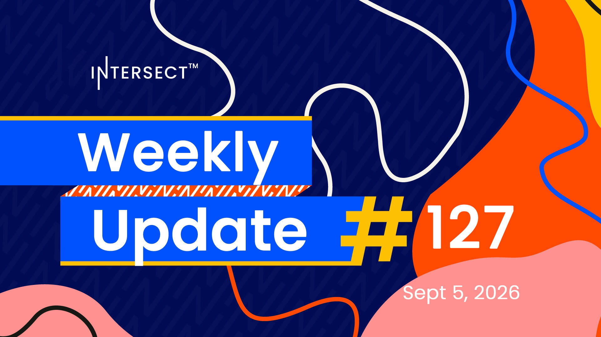

Intersect detailed the Dijkstra era node roadmap, placing potential hard fork enactment between December 5 and January 4 with a high-confidence window from February 24 to March 26. The Constitutional Committee update ratified with 71.95% DRep and 56.54% SPO support, and the newly elected committee takes seats without a gap in oversight. The Board Election opened applications for two member-elected seats, and the Constitutional Amendment Portal added threaded discussions, a drafts area, and co-author crediting.

[**Read more**](https://www.intersectmbo.org/news/intersect-weekly-update-127-sep-5-2026)

