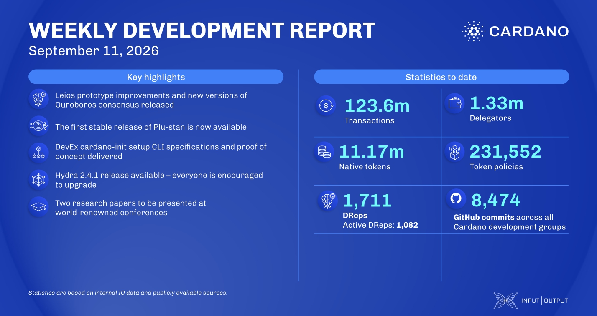

The Leios download logic was rewritten to bound time and memory, a transaction cache was added, unwanted node disconnects were fixed, and mempool ledger reads were capped, while ledger state garbage collection was threaded. Plutus merged casing on Data, advanced the keepPolicies and dropPolicies built-ins for the future Dijkstra era, and released Plu-tan 1.0, the static analyzer for Plutus scripts. Hydra shipped 2.4.1, a security release removing an optimized transaction-validation path that could let a malicious participant get invalid transactions into confirmed snapshots.

[**Read more**](https://www.essentialcardano.io/development-update/weekly-development-report-as-of-2026-09-11)

