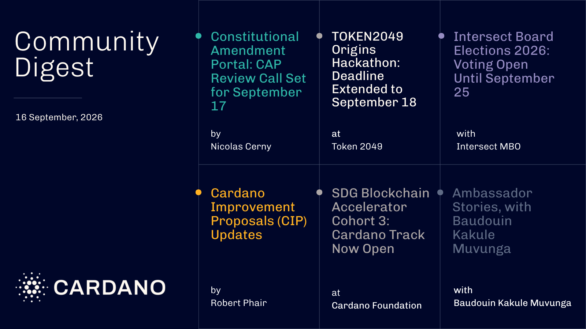

The TOKEN2049 Origins Hackathon called for builders to create AI agent payment solutions on Cardano using x402, with 200 free spots and $27,500 in prizes. The Constitutional Amendment Portal opened seven proposals to community consultation, Intersect Board Elections opened voting for eleven candidates across two seats, and the SDG Blockchain Accelerator opened applications for up to four equity-free funded teams.

[**Read more**](https://forum.cardano.org/t/digest-september-16-2026-token2049-origins-hackathon-constitutional-amendment-portal-intersect-board-elections-2026-sdg-blockchain-accelerator-ambassador-stories-baudouin-kakule-muvunga/156830)

