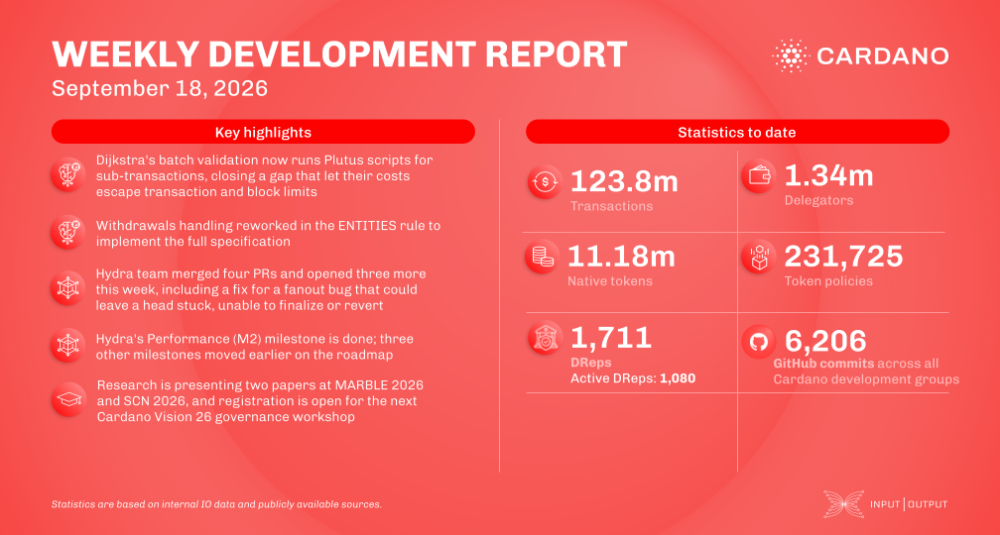

Dijkstra batch validation was implemented so Plutus scripts for sub-transactions now run and their execution budgets count toward block and fee limits, closing a gap where validators and minting policies went unchecked. Withdrawals handling was reworked in the ENTITIES rule, TxInfo translation for protocol version 4 was implemented, and Leios protocol parameters landed in the Dijkstra era. Hydra closed a fanout wedge that could leave a head stuck after a partial withdrawal, stabilized broadcast connections under heavy load, and completed the Performance milestone.

[**Read more**](https://www.essentialcardano.io/development-update/weekly-development-report-2026-09-18)

