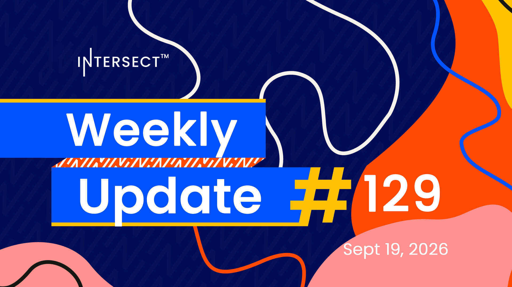

Intersect released cardano-node 11.1.2, which supersedes 11.1.1 and asks SPOs to prioritize the upgrade alongside mithril-signer 1.1.9. The Dingo Go node validated mainnet blocks, a milestone for node diversity, while the Board Election entered its final week with eleven candidates competing for two seats. The Constitutional Amendment Portal holds seven proposals in consultation, and three governance actions remain live, including the OpenZeppelin Stack treasury withdrawal and the minPoolCost parameter change.

[**Read more**](https://www.intersectmbo.org/news/intersect-weekly-update-129-sep-19-2026)

