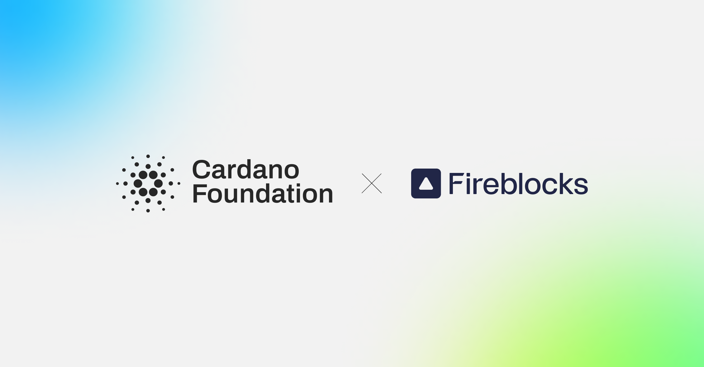

Tokens that use the Cardano Token Registry (CIP-26) and the on-chain metadata standard (CIP-68) become standard assets on Fireblocks, where they previously required manual steps. Fireblocks has supported ada since 2021, and support for the tokens is expected by March 2027 across its bank, exchange, payment, and fintech clients.

[**Read more**](https://cardanofoundation.org/blog/fireblocks-cardano-native-tokens)

