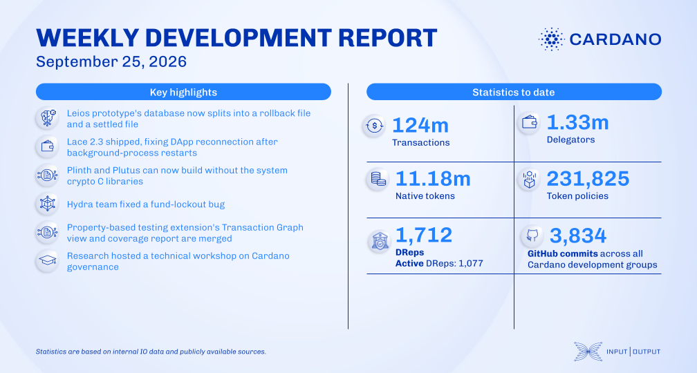

Certified Endorser Blocks move from the rollback file to the settled one in the background, so each database file can live on its own disk, and garbage collection marks rows before deleting them in batches instead of blocking the node. Lace 2.3 shipped reworked staking and DRep browsers with broader hardware wallet support, Hydra fixed a Mesh SDK deposit lockout and replaced 13 slow end-to-end tests with 30 unit tests, and Plutus closed out its September milestones.

[**Read more**](https://www.essentialcardano.io/development-update/weekly-development-report-2026-09-25)

