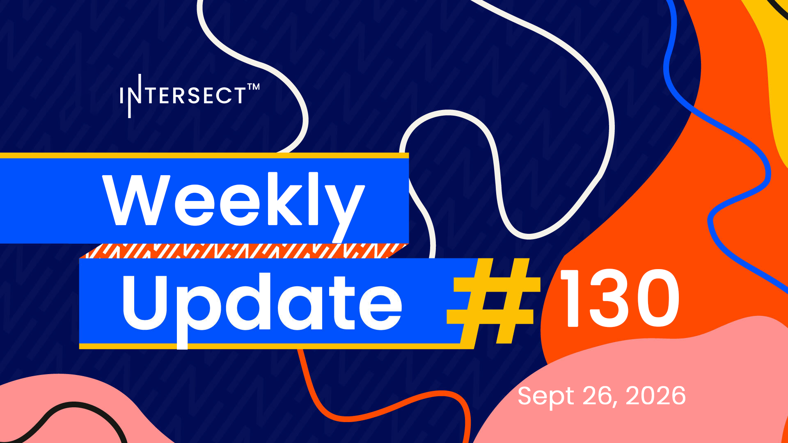

Cardano Node 11.2 should carry the new block format and Plutus V4 context but not Leios, and it is not a hard fork-ready release, so tooling teams are asked to assess breaking APIs early. The Parameter Committee is reviewing roughly 100 new Dijkstra guardrails plus about 50 for Peras, wallet vendors are being briefed on BLS key changes, and the Civics Committee rebuilt its knowledge base around six completed objectives.

[**Read more**](https://www.intersectmbo.org/news/intersect-weekly-update-130-sep-2-20266)

