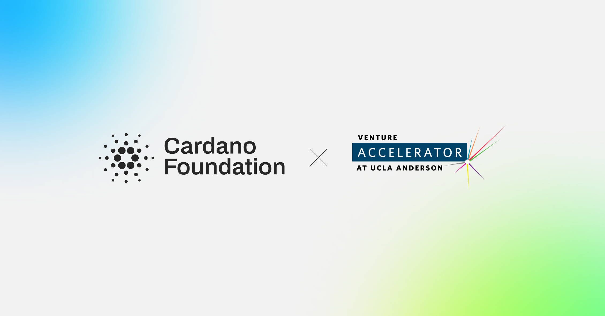

Cardano Academy material and use cases enter UCLA's blockchain coursework, including Blockchain Cryptocurrency Applications in Business and Finance, from 2027. The agreement also sponsors five fellowships for early-stage companies in the UCLA Accelerate program and covers the Foundation's sponsorship of the 2027 Draper Innovation Showcase, extending education work already running with the University of Zurich, the University of Brasília, and PUC-Rio.

[**Read more**](https://cardanofoundation.org/blog/ucla-partnership)

