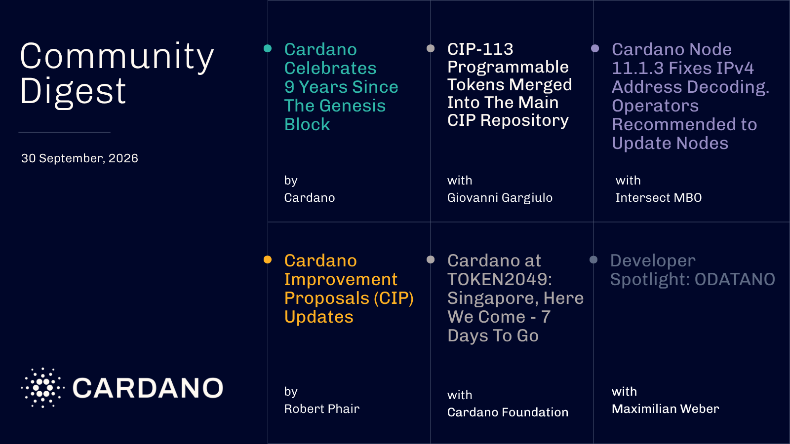

Transfer rules such as allowlists, freezes, and jurisdiction limits can now live inside the asset itself, after CIP-113 was merged into Cardano's main CIP repository. Cardano marked nine years since its genesis block with 2,890 stake pools, 123.98 million transactions, and 158 governance actions, while Intersect shipped node 11.1.3 to fix IPv4 address decoding. The Foundation also detailed a UCLA Anderson partnership.

[**Read more**](https://forum.cardano.org/t/digest-september-30-9-years-of-cardano-cip-113-programmable-tokens-merged-into-the-cip-repo-cardano-node-update-token2049-singapore-developer-spotlight-ecosystem-governance-updates/157100)

