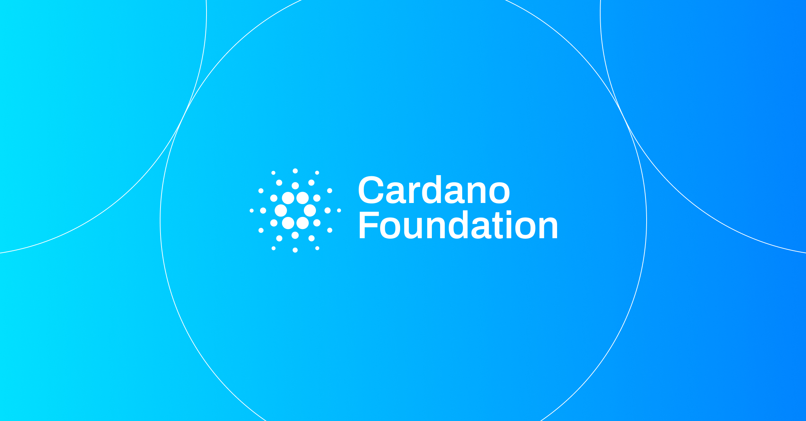

Cardano provides the traceable record behind the SAF Book-and-Claim model, showing where an environmental benefit originated, who it was assigned to, and that it has been claimed only once, with travelers able to calculate their route's CS-SAF amount and receive a certificate. The Diesel R application converts information from each production, transport, and use stage into a continuous record that can support Scope 3 emissions reporting.

[**Read more**](https://cardanofoundation.org/blog/renewable-fuel-traceability-petrobras)

