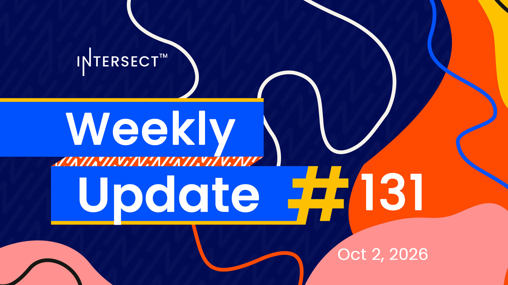

Cardano node 11.1.3 corrects an IPv4 decoding issue introduced in 11.1.2, and 11.2 is expected to carry the new block format and Plutus V4 context without Leios once its pre-release lands. CAP-12 adds every new Dijkstra protocol parameter to the Constitution in three steps, with guardrails and an SPO vote for security-critical settings, and the technical steering committee is recruiting two funded CIP editors.

[**Read more**](https://www.intersectmbo.org/news/intersect-weekly-update-131-oct-2-2026)

