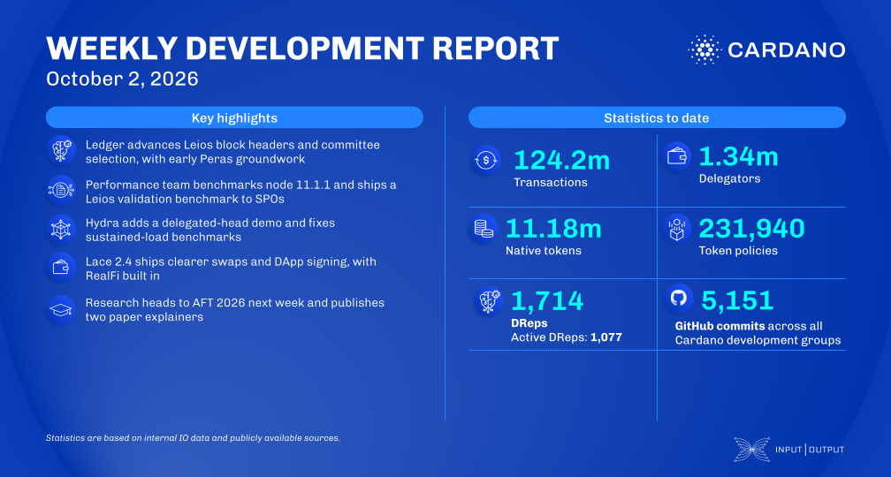

The Leios committee is selected at the epoch boundary, Plutus scripts can now see the sub-transaction index, and Dijkstra gains protocol parameters for reference-input costs. Node 11.1.1 benchmarks keep the CPU gains of 11.1.0, the Leios transaction benchmark runs standalone for SPOs without nix or a Haskell toolchain, and Hydra reports BacklogFull only when its backlog would take too long to clear.

[**Read more**](https://www.essentialcardano.io/development-update/weekly-development-report-2026-10-02)

