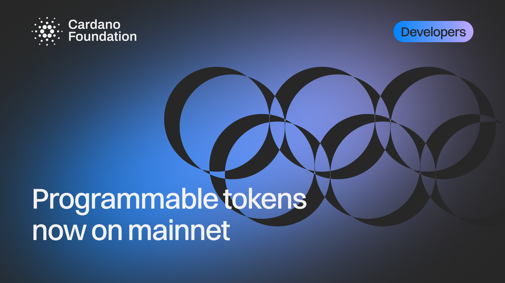

Programmable tokens stay native Cardano assets built on the EUTXO model, so wallets, explorers, and applications handle them like any other token while compliance logic travels with the asset and execution costs stay predictable. The standard launches with support from Eternl, GeroWallet, CardanoScan, and BloxBean, and CMTA recognizes CIP-113 as a smart contract equivalent to the CMTAT for its certification scheme.

[**Read more**](https://cardanofoundation.org/blog/programmable-tokens-cardano-mainnet)

