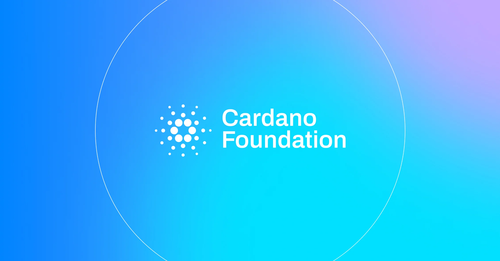

The .ada application joins .sol, .ethereum, .btc, and .bitcoin among Web3 bids in ICANN's first new gTLD round since 2012, after a Cardano governance action passed with roughly 75% support. If approved, .ada could support simplified wallet addresses, integration with decentralized identity such as Veridian, and domain tokenization.

[**Read more**](https://cardanofoundation.org/blog/ada-icann-next-stage)

