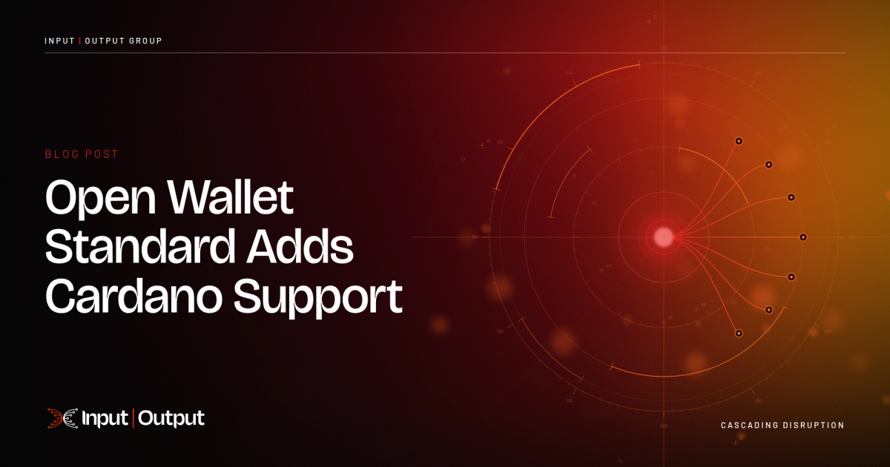

Applications and AI agents keep wallets on the machine they run on and sign through one interface across Ethereum, Solana, Bitcoin, and now Cardano. Each agent can get its own access key with policies OWS evaluates before signing, and the integration extends the signer to derive payment and stake keys separately under CIP-1852.

[**Read more**](https://www.iog.io/news/open-wallet-standard-adds-cardano-support)

